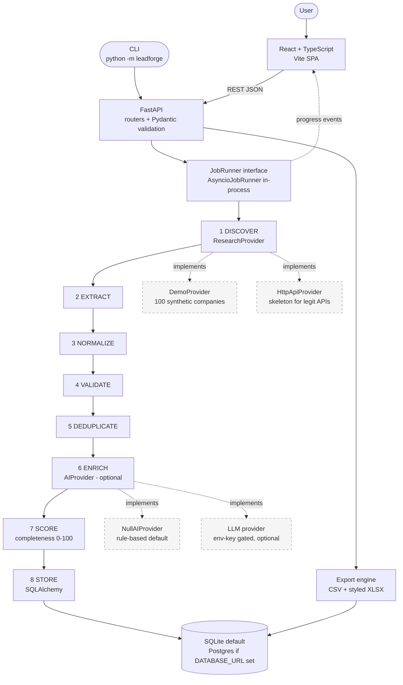

# LeadForge — Phase 1 Design Document

**Status:** Proposed — awaiting approval before implementation.
**Date:** 2026-09-28
**Repo name:** `leadforge`

This document is the complete Phase 1 output: final repository structure, architecture diagram,
data model, API contract, pipeline interfaces, frontend route map, testing strategy, demo data
spec, CLI spec, and the phased implementation plan with verification gates.

All 19 adjustments from the approval message are incorporated and marked **[A#]** where relevant.

---

## 1. Repository structure (final)

```
leadforge/
├── README.md                      # 60-second freelance-client README (A17, A12, A18)
├── LICENSE                        # MIT
├── CHANGELOG.md
├── CONTRIBUTING.md
├── .gitignore
├── .env.example
├── docker-compose.yml             # frontend + backend + worker + postgres (A2: no celery/redis)
├── Makefile                       # dev, test, seed-demo, reset-demo, run-demo shortcuts
├── docs/
│   ├── architecture.md            # expanded narrative of §2
│   ├── api.md                     # generated from §4 + Swagger link
│   ├── demo-guide.md              # the Jewelry Stores / 100 demo walkthrough (A4)
│   ├── deployment.md              # Vercel + Render/Railway/Fly.io + Postgres provider
│   ├── data-privacy.md            # what is/isn't collected, robots.txt, rate limits (A7)
│   └── demo/
│       ├── README.md              # capture checklist (A13) — 30–60s video shot list
│       └── placeholders.md        # "screenshots go here" markers; NOT fabricated
├── scripts/
│   └── dev.sh                     # one-command local run: backend + frontend (A1)
├── sample_data/
│   └── README.md                  # notes on the synthetic dataset; generator lives in backend
├── backend/
│   ├── requirements.txt
│   ├── requirements-dev.txt       # pytest, pytest-cov, httpx (TestClient)
│   ├── Dockerfile
│   ├── README.md
│   ├── leadforge/                 # importable package; CLI via `python -m leadforge`
│   │   ├── __main__.py            # `python -m leadforge ...` entrypoint
│   │   ├── cli.py                 # seed-demo | reset-demo | run-demo | export | serve (A15)
│   │   ├── config.py              # pydantic-settings; DATABASE_URL optional (A1)
│   │   ├── logging_config.py      # structured logging, secret redaction
│   │   ├── main.py                # FastAPI app factory, routers, error handlers
│   │   ├── db.py                  # engine/session; SQLite default, Postgres if DATABASE_URL (A1)
│   │   ├── models.py              # SQLAlchemy models (§3)
│   │   ├── schemas.py             # Pydantic request/response models (§4)
│   │   ├── api.py                 # routers: jobs, results, providers, health
│   │   ├── pipeline/
│   │   │   ├── __init__.py
│   │   │   ├── runner.py          # JobRunner ABC + AsyncioJobRunner; replaceable (A2)
│   │   │   └── stages/
│   │   │       ├── normalize.py
│   │   │       ├── validate.py
│   │   │       ├── dedupe.py
│   │   │       └── score.py
│   │   ├── providers/
│   │   │   ├── base.py            # ResearchProvider ABC (A10)
│   │   │   ├── demo.py            # DemoProvider: 100 realistic synthetic companies (A3)
│   │   │   └── http.py            # HttpApiProvider skeleton — where a legit API goes (A10)
│   │   ├── ai/
│   │   │   ├── base.py            # AIProvider ABC
│   │   │   ├── null.py            # NullAIProvider / rule-based default (A8)
│   │   │   └── llm.py             # optional LLM provider, env-key gated (A8)
│   │   ├── services/
│   │   │   ├── jobs.py            # job lifecycle: create → run → progress → complete
│   │   │   └── export.py          # CSV + styled XLSX (A11)
│   │   └── seed.py                # synthetic dataset generator (A3, A14)
│   └── tests/
│       ├── conftest.py            # fixtures, test DB, demo_delay forced to 0 (A4)
│       ├── fixtures.py            # dirty synthetic records for stage tests
│       ├── test_normalize.py
│       ├── test_validate.py
│       ├── test_dedupe.py
│       ├── test_score.py
│       ├── test_export.py
│       ├── test_providers.py
│       ├── test_jobs_api.py       # integration: create → poll → results → export
│       └── test_cli.py
└── frontend/
    ├── package.json               # vite + react + typescript; no UI kit
    ├── vite.config.ts
    ├── tsconfig.json
    ├── Dockerfile
    ├── nginx.conf
    ├── index.html
    └── src/
        ├── main.tsx
        ├── App.tsx                # router (§6)
        ├── api/
        │   └── client.ts          # typed fetch client for §4
        ├── pages/
        │   ├── Dashboard.tsx      # (A) stats + recent jobs
        │   ├── NewResearch.tsx    # (B) form + "what we'll collect" pre-flight
        │   ├── JobProgress.tsx    # (C) live 8-stage pipeline (A4)
        │   ├── Results.tsx        # (D) data table (A5)
        │   ├── RecordDetail.tsx   # (A6) explainability view
        │   └── Settings.tsx       # (A9) provider health + demo controls
        ├── components/
        │   ├── StatCard.tsx
        │   ├── PipelineStages.tsx
        │   ├── DataTable.tsx      # search/sort/filter/paginate/column visibility
        │   ├── ScoreBadge.tsx     # High/Medium/Low completeness (A7)
        │   ├── SyntheticBadge.tsx # "SYNTHETIC" label on demo data (A3, A7)
        │   ├── DetailDrawer.tsx
        │   └── EmptyState.tsx
        └── styles.css             # clean dashboard CSS; no gradients/3D
```

**Deliberately absent (A16):** no Celery/Redis, no microservices, no component library,
no ORM-per-database forks, no scraping stack. One backend service, one frontend, one database.

---

## 2. Architecture diagram



**Request flow for a research job:**

1. `POST /api/research/jobs` validates input (Pydantic), creates a `ResearchJob` row with
   status `queued`, returns `202 Accepted` with the job id. The HTTP request never blocks.
2. `AsyncioJobRunner` picks up the job, runs the 8 stages, and emits progress events
   (stage, processed, accepted, duplicates, errors, pct) after each batch. The frontend polls
   `GET /api/research/jobs/{id}` (simple, no websocket theater for v1).
3. Each stage is a pure function/module with a single input/output contract (see §5), so the
   runner can later be swapped for Celery/RQ without touching stage code (A2).
4. Demo mode inserts a small configurable delay per batch (`demo_delay_ms`, default e.g. 120ms)
   so the pipeline is visibly running; tests and CLI set it to `0` (A4).

---

## 3. Data model

Single SQLAlchemy model set; SQLite and Postgres share it (A1). UUIDs stored as strings
(portable across both backends).

### `research_jobs`

| Field | Type | Notes |
|---|---|---|
| id | String (uuid) PK | |
| industry | String | e.g. "Jewelry Stores" |
| country | String | e.g. "United States" |
| region | String, nullable | e.g. "California" |
| city | String, nullable | |
| keywords | String, nullable | |
| requested_leads | Integer | 10 / 50 / 100 / 500 |
| provider | String | default `"demo"` |
| enable_ai | Boolean | default `false`; UI shows Enabled/Disabled (A8) |
| demo_delay_ms | Integer | default `120`; `0` in tests/CI (A4) |
| status | String | `queued` → `running` → `completed` / `failed` |
| stage | String, nullable | current stage name for progress UI |
| progress_pct | Integer | 0–100 |
| discovered / processed / accepted / duplicates / invalid | Integer | live counters (A4) |
| error | Text, nullable | failure reason if `failed` |
| created_at / completed_at | DateTime | |

### `companies`

| Field | Type | Notes |
|---|---|---|
| id | String (uuid) PK | |
| company_name | String | as discovered |
| normalized_name | String, indexed | lowercased, punctuation/entity-stripped |
| website | String, nullable | as discovered |
| normalized_domain | String, nullable, indexed | `https://www.Example.com/` → `example.com` |
| industry / country / region / city / address | String, nullable | address normalized (whitespace/punct) |
| phone / phone_normalized | String, nullable | E.164-ish where possible |
| public_email | String, nullable | lowercased |
| linkedin_url / source_url | String, nullable | |
| source_provider | String | which provider produced it |
| is_synthetic | Boolean | **always true for demo data** (A3) |
| created_at / updated_at | DateTime | |

### `lead_results` (job ↔ company link + scoring)

| Field | Type | Notes |
|---|---|---|
| id | String (uuid) PK | |
| job_id | FK → research_jobs | |
| company_id | FK → companies | |
| quality_score | Integer 0–100 | **data completeness score** (A7) |
| score_factors | JSON | `{website: 20, company_name: 20, ...}` — explainable (A6) |
| validation_status | String | `valid` / `invalid` |
| validation_issues | JSON | list of `{field, code, message}` |
| verification_status | String | default `"unverified"`; demo data is **never** marked verified (A7) |
| ai_enriched | Boolean | |
| ai_fields | JSON, nullable | each AI-derived value tagged `{"value":…, "ai_derived": true}` (A8) |
| dedupe_status | String | `unique` / `duplicate_removed` / `needs_review` |
| duplicate_of_id | FK → companies, nullable | for traceability |
| collected_at | DateTime | |

### `rejected_records` (validation/dedupe transparency)

| Field | Type | Notes |
|---|---|---|
| id | String (uuid) PK | |
| job_id | FK → research_jobs | |
| stage | String | `validate` or `deduplicate` |
| reason | String | human-readable |
| raw_data | JSON | the record as discovered |

This table powers the "validation report" and the duplicates/invalid counters honestly —
nothing is silently dropped.

---

## 4. API contract

Base path `/api`. All responses JSON except exports. Errors: structured
`{"detail": …, "code": …}` with proper status codes. Swagger at `/docs`.

| Method & Path | Request | Response | Notes |
|---|---|---|---|
| `POST /api/research/jobs` | `JobCreate`: industry, country, region?, city?, keywords?, requested_leads (10/50/100/500), provider="demo", enable_ai=false, demo_delay_ms=120 | `202` `JobRead` (incl. status `queued`) | never blocks |
| `GET /api/research/jobs` | `?page=&page_size=` | `200` `{items: [JobSummary], total}` | dashboard "recent jobs" |
| `GET /api/research/jobs/{id}` | — | `200` `JobRead` + live counters + stage | progress polling |
| `GET /api/research/jobs/{id}/results` | `?search=&industry=&region=&city=&min_score=&max_score=&validation_status=&verification_status=&sort=&order=&page=&page_size=` | `200` `{items: [ResultRow], total, page, page_size}` | powers the table (A5) |
| `GET /api/research/jobs/{id}/results/{result_id}` | — | `200` `ResultDetail` | record detail view (A6) |
| `DELETE /api/research/jobs/{id}/results/{result_id}` | — | `204` | delete record |
| `POST /api/research/jobs/{id}/export?format=csv\|xlsx` | — | `200` file download | (A11) |
| `GET /api/research/jobs/{id}/validation-report` | — | `200` `{total, valid, invalid, duplicates, issues_by_field}` | |
| `GET /api/providers/health` | — | `200` `{demo: {status, detail}, http: {…}, ai: {…}, database: {…}}` | settings page (A9) |
| `GET /api/health` | — | `200` `{"status": "ok", "version": …}` | |
| `POST /api/demo/seed` | — | `200` `{companies: 100}` | seed-demo via UI too (A14) |
| `POST /api/demo/reset` | — | `200` | reset-demo (A14) |

`ResultDetail` includes: company fields, normalized fields, source, validation results,
completeness score + factor breakdown, AI-derived fields (tagged), dedupe status,
collection timestamp, `is_synthetic` flag (A6, A7).

---

## 5. Pipeline interfaces

### 5.1 `ResearchProvider` (ABC) — `backend/leadforge/providers/base.py`

```python
class CompanyQuery(BaseModel):
    industry: str
    country: str
    region: str | None = None
    city: str | None = None
    keywords: str | None = None

class RawCompany(BaseModel):
    company_name: str | None = None
    website: str | None = None
    industry: str | None = None
    country: str | None = None
    region: str | None = None
    city: str | None = None
    address: str | None = None
    phone: str | None = None
    public_email: str | None = None
    linkedin_url: str | None = None
    source_url: str | None = None
    is_synthetic: bool = False

class ResearchProvider(ABC):
    name: str

    @abstractmethod
    async def search_companies(self, query: CompanyQuery, limit: int) -> list[RawCompany]: ...
    @abstractmethod
    async def get_company_details(self, ref: str) -> RawCompany | None: ...
    @abstractmethod
    def extract_contacts(self, raw: RawCompany) -> ContactInfo: ...
    def health(self) -> ProviderHealth: ...   # default: {"status": "unknown"}
```

- `DemoProvider` implements all three against the synthetic dataset (A3, A10).
- `HttpApiProvider` is a documented skeleton: config shape, `search_companies` raising
  `NotConfiguredError` with instructions, and comments marking exactly where a legitimate
  API client (with key from env) would attach. No scraping, no bot evasion (A10).

### 5.2 Stage contracts — `backend/leadforge/pipeline/stages/`

Each stage is a module of pure functions operating on Pydantic models — no DB, no HTTP —
so they are trivially unit-testable:

```python
# normalize.py
def normalize_company_name(name: str | None) -> str | None
def normalize_domain(url_or_domain: str | None) -> str | None
def normalize_phone(phone: str | None, default_country: str | None) -> str | None
def normalize_email(email: str | None) -> str | None
def normalize_address(address: str | None) -> str | None
def normalize_record(raw: RawCompany) -> NormalizedCompany

# validate.py
def validate_record(rec: NormalizedCompany) -> ValidationResult
# ValidationResult: is_valid, issues: list[{field, code, message}]
# codes (stable, UPPER_SNAKE, closed set): MISSING_COMPANY_NAME | INVALID_COMPANY_NAME |
#   INVALID_EMAIL | INVALID_DOMAIN | INVALID_PHONE | MISSING_LOCATION | INVALID_RECORD

# dedupe.py
def find_duplicates(records: list[NormalizedCompany])
    -> tuple[unique: list, duplicates: list[DuplicateMatch]]
# DuplicateMatch: record, matched_id, rule: exact_domain | name_location |
#                exact_email | fuzzy_name, confidence, needs_review: bool
# Rules 1–3 auto-remove; fuzzy matches with confidence < threshold → needs_review (never silently deleted)

# score.py
COMPLETENESS_WEIGHTS = {website:20, company_name:20, location:15, phone:15,
                        public_email:20, source:10}   # = 100, transparent
def completeness_score(rec) -> tuple[int, dict[str, int]]  # score + per-factor breakdown
def completeness_band(score: int) -> "High" | "Medium" | "Low"  # 90–100 / 70–89 / <70
```

### 5.3 `AIProvider` (ABC) — `backend/leadforge/ai/base.py`

```python
class AIProvider(ABC):
    name: str
    enabled: bool
    @abstractmethod
    async def classify_company(self, company: NormalizedCompany, industry: str) -> str | None: ...
    @abstractmethod
    async def extract_company_information(self, text: str) -> dict | None: ...
    @abstractmethod
    async def summarize_company(self, company: NormalizedCompany) -> str | None: ...
```

- `NullAIProvider` (`enabled=False`): returns `None` / `"Unknown"`; rule-based industry
  normalization only. **Default — app fully works without any key (A8).**
- `LLMProvider` (`enabled=True` only if `LEADFORGE_LLM_API_KEY` set): thin wrapper; system
  prompt forbids inventing data; every returned field wrapped as `{"value":…, "ai_derived": true}`.
  Provider-agnostic interface so OpenAI/Anthropic/etc. can slot in.

### 5.4 `JobRunner` (ABC) — `backend/leadforge/pipeline/runner.py`

```python
class StageProgress(BaseModel):
    stage: str            # DISCOVER | EXTRACT | NORMALIZE | VALIDATE | DEDUPLICATE | ENRICH | SCORE | STORE
    processed: int
    accepted: int
    duplicates: int
    errors: int
    pct: int

class JobRunner(ABC):
    @abstractmethod
    async def run(self, job_id: str, on_progress: Callable[[StageProgress], None]) -> JobOutcome: ...

class AsyncioJobRunner(JobRunner): ...   # v1: FastAPI BackgroundTasks + asyncio (A2)
```

The runner orchestrates stage modules and persists via `services/jobs.py`. Replacing it
with Celery later means implementing `JobRunner.run` differently — stages untouched.

---

## 6. Frontend route map

| Route | Page | Purpose |
|---|---|---|
| `/dashboard` | Dashboard | Stat cards (leads generated, successful records, duplicates removed, validation failures), recent-jobs table, "Create Lead List" CTA |
| `/research/new` | NewResearch | form (industry, country, region?, city?, keywords?, 10/50/100/500, provider multi-select where available) + pre-flight panel: "We will collect: company name, website, location, phone, public email, LinkedIn URL (if public), source URL" + [Start Research] |
| `/research/:id` | JobProgress | 8-stage vertical pipeline with live counters (A4); on completion → [View Results] [Download CSV] [Download Excel] |
| `/results/:id` | Results | DataTable (A5): search, sort, pagination, filters (state/city/industry, score band, validation status, verification status), column visibility, copy row, source link, delete, CSV/XLSX export |
| `/results/:id/record/:resultId` | RecordDetail | (A6): company info, normalized info, source, validation results, score + breakdown, AI fields (tagged), dedupe status, collected_at, synthetic badge |
| `/settings` | Settings | (A9): provider health cards (Demo: Available / HTTP: Not configured / AI: Disabled·or·Configured / Database: Connected), demo seed/reset buttons, AI enablement state |

Design language: light neutral surfaces, one accent color, tabular numerals, dense-but-airy
tables, status pills. No gradients, no 3D, no animation theater (per brief).

---

## 7. Testing strategy

- **Framework:** pytest + pytest-cov. `conftest.py` provides: temp SQLite DB, `demo_delay_ms=0`
  override (A4), and fixture factories.
- **Unit tests** (`tests/test_*.py`): normalization (name/domain/phone/email/address edge cases),
  validation (each issue code), dedupe (exact domain, name+location, email, fuzzy threshold,
  `needs_review` behavior), scoring (weights sum to 100, bands), export (CSV content, XLSX
  sheets/formatting/frozen panes via openpyxl read-back), providers (demo returns N, health shapes).
- **Integration tests** (`test_jobs_api.py`): full lifecycle with `TestClient` —
  create job → poll to completion → results query (search/filter/sort/paginate) →
  record detail → validation report → CSV + XLSX export → delete record.
- **CLI tests** (`test_cli.py`): seed-demo/reset-demo/run-demo/export round-trip.
- **Coverage:** measured and reported honestly from the core logic (`pipeline/`, `services/`,
  `providers/`); target ≥85% on those packages. No fabricated numbers — the CI output is the claim.
- **Demo determinism:** seeded RNG (`LEADFORGE_DEMO_SEED`) so the "100 discovered / 91 unique /
  6 duplicates / 3 invalid" style walkthrough is reproducible for the demo video (A13).

---

## 8. Demo dataset spec (A3)

Generated by `backend/leadforge/seed.py` (seeded RNG, committed generator — not a static blob):

- **100 companies**, ~6 industries (Jewelry Stores, Dental Clinics, Specialty Coffee Roasters,
  Boutique Hotels, Craft Breweries, IT Consultancies), spread across CA / TX / NY / FL / IL
  with 2–3 cities each, varied company sizes.
- **Realism defects (intentional):** ~6 exact duplicates (domain written 3 ways:
  `https://www.` / `http://` / bare), ~4 near-duplicate names ("ABC Jewelry LLC" vs
  "abc jewelry"), ~8 records with missing fields, ~5 malformed emails (`john@@example..com`),
  ~4 malformed URLs, phone formats mixed (`(415) 555-0132`, `415.555.0132`, `+1-415-555-0132`),
  completeness spread across High/Medium/Low bands.
- **Safety:** all emails `@example.com`, all phones in the fictional `555-01XX` range, websites
  on `example.com` subdomains, LinkedIn URLs either `null` or on the unmistakably synthetic
  reserved domain `example.com` (never real third-party domains such as linkedin.com),
  **no real personal names** (role-based contacts only, e.g. `info@`,
  `sales@`), every row `is_synthetic=True`, UI shows a persistent **SYNTHETIC DEMO DATA** badge,
  README + data-privacy doc state this explicitly.
- The demo walkthrough target (A4 demo workflow): requesting 100 yields approximately
  **100 discovered → ~90 unique → ~6 duplicates → ~4 invalid → ~90 usable** (exact numbers
  fall out of the seeded generator and will be stated exactly in the demo guide once built).

---

## 9. CLI spec (A15)

`python -m leadforge <command>` (also via `Makefile` shortcuts):

| Command | Effect |
|---|---|
| `seed-demo` | generate + insert the 100-company synthetic dataset |
| `reset-demo` | wipe demo data (jobs + companies + results), re-seed optional `--reseed` |
| `run-demo --industry "Jewelry Stores" --country "United States" --region California --leads 100 [--no-delay]` | run the full pipeline headless, print stage summary |
| `export --job <id> --format xlsx --out leads.xlsx` | export a completed job's dataset |
| `serve [--host --port]` | run the API (dev) |

---

## 10. Export spec (A11)

- **CSV:** UTF-8 with BOM (Excel-friendly), header row = the 14 result columns, one row per
  accepted record, `is_synthetic` column included for honesty.
- **XLSX (openpyxl):** sheet 1 `Leads` — styled header (bold, fill, bottom border), auto-filter,
  frozen top row, sensible column widths, score as number with conditional band label,
  validation/verification status columns, source URL as hyperlink, collection date formatted;
  sheet 2 `Research Summary` — totals (discovered/unique/duplicates/invalid), average
  completeness, research parameters, timestamp; sheet 3 `Parameters` — the exact job inputs.
  File name: `leadforge_<industry>_<jobshortid>.xlsx`.

---

## 11. Implementation plan (phases 2–15) with verification gates

| Phase | Work | Gate (must pass before next phase) |
|---|---|---|
| 2 | Repo skeleton: structure above, configs, `.env.example`, `docker-compose.yml`, Makefile | `tree` matches §1; `make help` lists commands |
| 3 | Backend core: config, logging, models, db (SQLite↔Postgres), schemas | models create tables on both SQLite and Postgres (CI matrix or local pg) |
| 4 | Pipeline stages: normalize, validate, dedupe, score (+ unit tests) | `pytest backend/tests/test_{normalize,validate,dedupe,score}.py` green; coverage ≥85% on `pipeline/` |
| 5 | Providers + seed: `ResearchProvider` ABC, `DemoProvider`, `HttpApiProvider` skeleton, `seed.py` | `seed-demo` yields 100 rows with the defect mix from §8; `run-demo --no-delay` completes |
| 6 | Jobs: runner, `services/jobs.py`, job/result/export/health API | integration test: create → complete → results → export passes; progress endpoint shows all 8 stages |
| 7 | Export engine: CSV + styled XLSX | `test_export.py` green incl. openpyxl read-back of formatting/sheets |
| 8 | Frontend: all 6 routes + components, typed API client | `vite build` clean; pages render against mock data |
| 9 | Integration: frontend ↔ backend, demo delay visible, seed/reset from Settings | end-to-end demo walkthrough (§8 target numbers) works in browser |
| 10 | AI: `AIProvider` ABC, `NullAIProvider` default, `LLMProvider` gated; UI Enabled/Disabled indicator | app works with no key; with key, AI fields appear tagged `ai_derived` |
| 11 | Test hardening: full suite + coverage report | `pytest` green; honest coverage number recorded in README |
| 12 | Docker: backend/frontend/worker/postgres compose | `docker compose up` → full demo walkthrough works |
| 13 | E2E run: the exact demo workflow from the brief | 100 → discovered/unique/duplicates/invalid counts verified; CSV+XLSX downloaded |
| 14 | Bugfix: full 25-point quality audit from the brief | every checkbox passes or is fixed, not documented-around |
| 15 | Polish: README (all 20 sections + Mermaid + client-use-case + freelance-value), docs/demo placeholders, CHANGELOG | README answers the 6 questions in <60s (A17); repo ready to `git init` + push |

**Non-goals for v1:** real scraping integrations, auth/multi-user, websockets, Celery/Redis,
hosted deployment (deployment-ready + documented instead).

---

## 12. Decisions & open questions

**Decided (from your adjustments):** SQLite default / Postgres opt-in (A1); in-process
`JobRunner`, no Celery/Redis (A2); synthetic dataset with labeled defects (A3); visible staged
pipeline with configurable delay (A4); record detail view (A6); "completeness" language only
(A7); AI optional + status indicator (A8); provider health page (A9); HTTP provider skeleton
(A10); 3-sheet XLSX (A11); client-use-case + freelance-value README sections (A12, A18);
`docs/demo/` capture checklist, no fabricated screenshots (A13); seed/reset commands (A14);
CLI (A15); working > complex (A16); 60-second README (A17).

**Two small calls I'll make unless you object:**
1. Python packaging: plain `requirements.txt` (not Poetry) — lowest friction for reviewers.
2. Frontend state: React Router + fetch, no Redux/Zustand — the app is table-and-form shaped;
   local state suffices and keeps it readable.

---

*End of Phase 1. Awaiting approval to begin Phase 2 (repository skeleton).*
